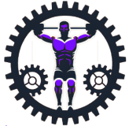

# GearGym App



GearGym is your ultimate fitness companion app designed to enhance your gym experience. With features like camera recognition for gym equipment, workout creation, calorie calculators, and professional guidance, GearGym ensures you get the most out of your fitness routine.

## Features

### Sign-In/Out Feature
Securely sign into your personal GearGym account to access personalized features and track your progress. Easy sign-out for when you're done.

### Home Screen
The main hub where users can navigate to different sections of the app, view important updates, and access various features.

### Camera Recognition
Use your phone's camera to recognize gym equipment and learn how to use them effectively.

> **Note:** The recognition feature using AWS's `detectCustomLabels` has a high cost. For testing or usage, please contact us to enable it. Alternatively, you can use `detectLabels` instead of `detectCustomLabels` by modifying the `_layout` in the `scannow` folder. Make sure to change the `stack.screen` name from `index` to `detectLabels`.


### Profile Edit (Pending)
Update your personal information, fitness goals, and preferences to tailor your GearGym experience. (This feature is pending development.)

### Find Professionals (Pending)
Search and connect with gym professionals for personalized, paid guidance and support. (This feature is pending development.)

## Requirements

To create an account on GearGym, the following requirements must be met:

- **Username:** Must be unique and contain between 3 and 20 characters.
- **Email:** Must be a valid email address.
- **Password Requirements:**
  - Minimum of 8 characters
  - At least one uppercase letter
  - At least one lowercase letter
  - At least one number
  - At least one special character (e.g., !@#$%^&*)

## Installation

1. Clone the repository:

   ```bash
   git clone https://github.com/WellingtonDevBR/geargym-cross.git
   ```
2. Navigate to the project directory:

   ```bash
   cd geargym-cross
   ```
3. Install the dependencies:

   ```bash
   npm install
   ```
4. Navigate to the project directory:

   ```bash
   npx expo start
   ```

### Usage

1. Sign Up: Create an account by providing a username, valid email, and a password that meets the requirements.
2. Log In: Access your account by logging in with your email and password.
3. Explore Features: Use the home screen to navigate through different features of the app.
4. Use Camera Recognition: Point your camera at gym equipment to get detailed information on how to use it.
5. Edit Profile: Update your profile information, fitness goals, and preferences (once the feature is available).
6. Find Professionals: Search for and connect with gym professionals for personalized guidance (once the feature is available).

### Screenshots

### Home Screen

### Camera Recognition

### License

This project is licensed under the MIT License. See the LICENSE file for more information.

### Contact

If you have any questions, feel free to reach out:

* Email: 6881@ait.nsw.edu.au